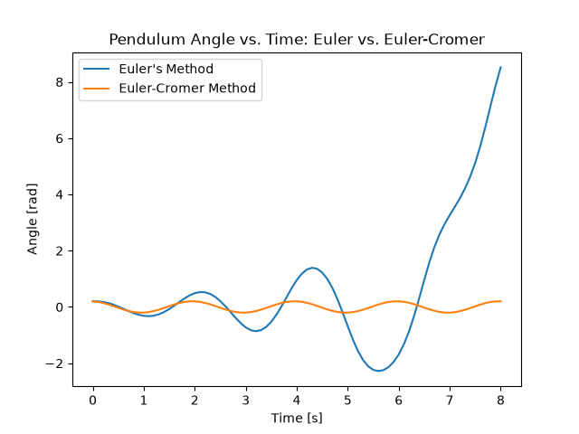
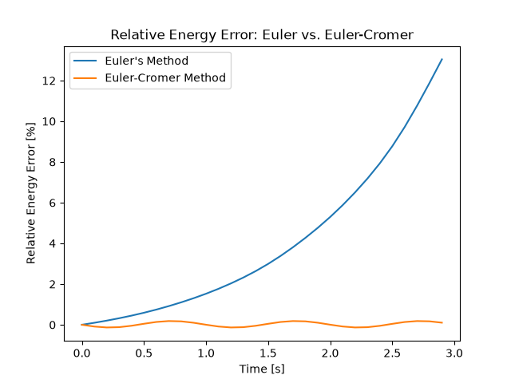
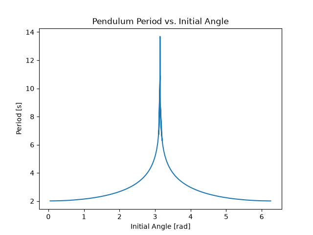
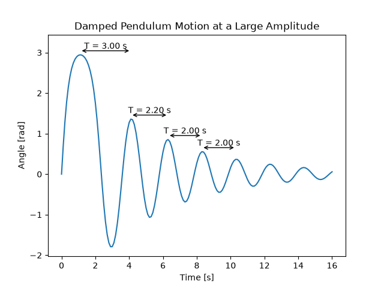
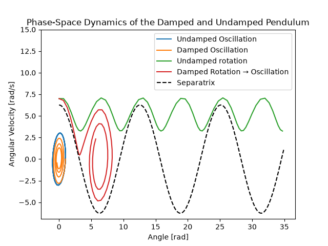
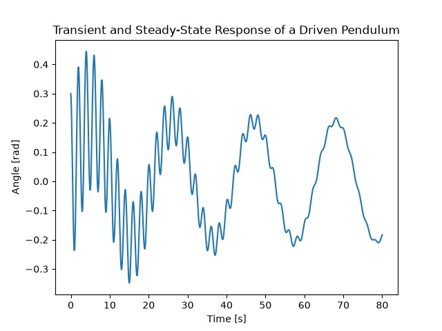
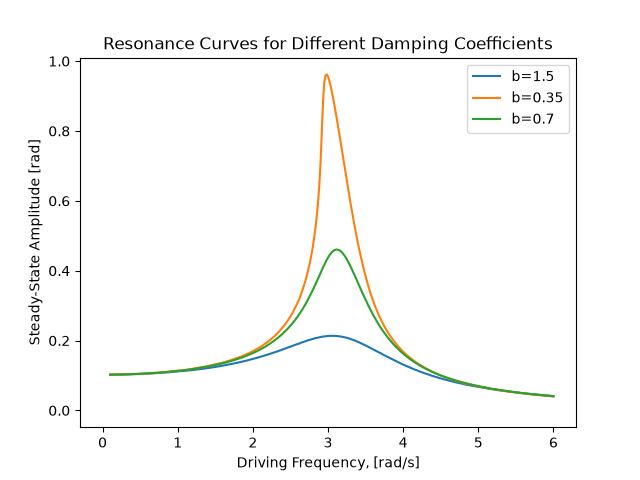

# Numerical Investigation of a Nonlinear Pendulum

A computational physics project investigating the dynamics of a pendulum through numerical simulation. The project begins by comparing Euler's Method and Euler-Cromer for the undamped pendulum, using energy behavior to examine the numerical properties of each method.

The model is then extended to investigate nonlinear effects, damping, and external forcing. In particular, the project explores how the pendulum's period depends on amplitude, how damping changes the phase-space dynamics, and how an external driving force produces resonance.

The project follows the progression

$$
\boxed{
\text{numerical methods}
\rightarrow
\text{nonlinear dynamics}
\rightarrow
\text{damping}
\rightarrow
\text{phase space}
\rightarrow
\text{external forcing}
\rightarrow
\text{resonance}
}
$$

## Motivation

The simple pendulum is often introduced using the small-angle approximation, where the equation of motion becomes that of a simple harmonic oscillator.

For sufficiently small angles,

$$
\sin\theta \approx \theta,
$$

giving the familiar linear equation

$$
\ddot{\theta}+\frac{g}{L}\theta=0.
$$

However, the full pendulum equation is nonlinear:

$$
\ddot{\theta}+\frac{g}{L}\sin\theta=0.
$$

This makes the pendulum a useful system for exploring both numerical methods and nonlinear dynamics.

The project begins by comparing Euler's Method with Euler-Cromer and examining how each method behaves when applied to a conservative system. The nonlinear pendulum is then investigated by measuring how its period changes with initial amplitude.

Damping is introduced next, allowing the evolution of energy and phase-space trajectories to be studied. Finally, an external driving force is added to investigate transient behavior and resonance, including how the resonance response changes with damping.

The main goal is to use numerical simulation not simply to reproduce pendulum motion, but to investigate the physical and mathematical structure of the system.

## Mathematical Model

The pendulum is represented by the state vector

$$
\mathbf{s}=
\begin{bmatrix}
\theta\\
\omega
\end{bmatrix}
$$

where $\theta$ is the angular displacement and $\omega=\dot{\theta}$ is the angular velocity.

The equation of motion is written as a coupled system of first-order differential equations.

### Undamped Pendulum

For an ideal undamped pendulum,

$$
\frac{d\theta}{dt}=\omega
$$

and

$$
\frac{d\omega}{dt}=
-\frac{g}{L}\sin\theta.
$$

The corresponding total mechanical energy is

$$
E=
\frac{1}{2}mL^2\omega^2
+
mgL(1-\cos\theta).
$$

For the continuous system, this quantity is conserved.

### Damped Pendulum

Linear damping is introduced through a resistive torque proportional to angular velocity.

The equation becomes

$$
mL^2\ddot{\theta}
+
b\dot{\theta}
+
mgL\sin\theta
=0,
$$

or

$$
\ddot{\theta}=
-\frac{g}{L}\sin\theta
-\frac{b}{mL^2}\dot{\theta}.
$$

The damping term removes mechanical energy from the system, causing the oscillation amplitude to decrease with time.

For the parameters used in the simulations,

$$
g=9.8\ {\rm m/s^2},
\qquad
L=1\ {\rm m},
\qquad
m=5\ {\rm kg},
\qquad
b=0.4\ {\rm kg/s}.
$$

### Driven Pendulum

An external sinusoidal torque is added to investigate forced oscillations:

$$
mL^2\ddot{\theta}
+
b\dot{\theta}
+
mgL\sin\theta=
\tau_0\sin(\omega_d t),
$$

where $\tau_0$ is the driving torque amplitude and $\omega_d$ is the driving frequency.

The resulting equation is

$$
\ddot{\theta}=
-\frac{g}{L}\sin\theta
-\frac{b}{mL^2}\dot{\theta}
+
\frac{\tau_0}{mL^2}\sin(\omega_d t).
$$

This system contains both transient and steady-state behavior. The transient response depends on the initial conditions and decays because of damping, while the steady-state response is maintained by the external driving force.

## Numerical Methods

The equations of motion are solved numerically using Euler's Method and Euler-Cromer.

### Euler's Method

Euler's Method updates both position and velocity using the values at the beginning of each timestep:

$$
\theta_{n+1}=
\theta_n
+
\Delta t\,\omega_n
$$

$$
\omega_{n+1}=
\omega_n
+
\Delta t
\left(
-\frac{g}{L}\sin\theta_n
\right).
$$

For a general system

$$
\frac{d\mathbf{s}}{dt}=f(\mathbf{s},t),
$$

Euler's Method is

$$
\mathbf{s}_{n+1}=
\mathbf{s}_n
+
\Delta t\,f(\mathbf{s}_n,t_n).
$$

Euler's Method has first-order global accuracy, with accumulated error proportional to $\Delta t$.

### Euler-Cromer Method

Euler-Cromer differs by updating the angular velocity before using it to update the angular position:

$$
\omega_{n+1}=
\omega_n
+
\Delta t
\left(
-\frac{g}{L}\sin\theta_n
\right)
$$

followed by

$$
\theta_{n+1}=
\theta_n
+
\Delta t\,\omega_{n+1}.
$$

Although Euler-Cromer has the same formal first-order accuracy as Euler's Method, its structure is much better suited to oscillatory systems. In particular, it avoids the unbounded energy growth that can occur when standard Euler integration is applied to conservative oscillators.

## Results

### 1. Euler vs. Euler-Cromer

The first comparison examines the trajectories produced by Euler's Method and Euler-Cromer for the same undamped pendulum.



**Figure 1.** Angular displacement of the undamped pendulum calculated using Euler's Method and Euler-Cromer. The comparison demonstrates the different numerical behavior of the two integration schemes for an oscillatory system.

Euler's Method gradually introduces energy into the system, causing the oscillation amplitude to grow. Euler-Cromer instead keeps the numerical energy bounded and therefore produces stable oscillations over long times.

### 2. Numerical Energy Behavior

The numerical energy error provides a more quantitative comparison between the two methods.



**Figure 2.** Relative energy error for Euler's Method and Euler-Cromer applied to the undamped pendulum. Euler's Method exhibits systematic energy growth, while Euler-Cromer's energy error remains bounded and oscillatory.

For the physical undamped pendulum, total mechanical energy should remain constant. The bounded oscillations in Euler-Cromer's energy error therefore represent qualitatively different numerical behavior from the secular energy growth produced by standard Euler integration.

This makes Euler-Cromer the preferred method for the subsequent pendulum simulations.

### 3. Nonlinear Dependence of Period on Amplitude

For small initial angles, the pendulum behaves approximately as a simple harmonic oscillator with period

$$
T_0=
2\pi\sqrt{\frac{L}{g}}.
$$

For the parameters used here,

$$
T_0=
2\pi\sqrt{\frac{1}{9.8}}
\approx2.01\ {\rm s}.
$$

The full nonlinear equation does not have a period that is independent of amplitude. The period was therefore measured numerically for a range of initial angles.



**Figure 3.** Pendulum period as a function of initial angle. The horizontal reference corresponds to the small-angle prediction $T_0=2\pi\sqrt{L/g}$. The increasing period at larger amplitudes demonstrates the nonlinear behavior of the pendulum.

For small initial angles, the numerical period approaches the small-angle prediction. At larger amplitudes, the period increases because the approximation $\sin\theta\approx\theta$ becomes increasingly inaccurate.

This provides a direct numerical demonstration that the ordinary pendulum is not exactly a simple harmonic oscillator.

### 4. Damping and the Changing Period

Linear damping was then introduced. A large initial amplitude was chosen so that the change in period during the decay could be clearly observed.



**Figure 4.** Angular displacement of a damped pendulum with a large initial amplitude. The periods of the first several oscillations are annotated to show the decrease in period as the amplitude decays. The period approaches the small-angle value of approximately $2.01$ s as the oscillation becomes smaller.

The first oscillations have noticeably longer periods because the pendulum begins in the nonlinear large-amplitude regime. As damping removes energy, the amplitude decreases and the period approaches the small-angle prediction.

For example, the measured periods transition approximately as

$$
3.00\ {\rm s}
\rightarrow
2.20\ {\rm s}
\rightarrow
2.00\ {\rm s}
\rightarrow
2.00\ {\rm s}.
$$

Thus damping does more than reduce the amplitude: because the pendulum is nonlinear, the loss of energy also changes the period.

### 5. Phase-Space Dynamics

The dynamics of the pendulum can be represented in phase space by plotting angular velocity against angular displacement.

For the undamped system, trajectories with sufficiently large energy can correspond to continuous rotation, while lower-energy trajectories correspond to oscillation.

The boundary between these two types of motion is the separatrix.

For $\theta_0=0$, the separatrix satisfies

$$
\frac{1}{2}mL^2\omega^2=
2mgL,
$$

giving

$$
\omega=
\pm2\sqrt{\frac{g}{L}}.
$$

More generally, the separatrix is

$$
\omega=
\pm2\sqrt{\frac{g}{L}}
\cos\left(\frac{\theta}{2}\right).
$$



**Figure 5.** Phase-space trajectories of the damped and undamped pendulum together with the separatrix. The undamped rotational trajectory remains in the rotational region, while the damped trajectory loses energy, crosses the separatrix, and transitions from rotation to oscillation before approaching equilibrium.

This demonstrates that damping can change not only the amplitude of the motion but its qualitative type. An initially rotating pendulum can lose enough energy to become an oscillating pendulum.

The phase-space representation therefore provides a compact description of the transition

$$
\boxed{
\text{rotation}
\rightarrow
\text{oscillation}
\rightarrow
\text{equilibrium}
}
$$

### 6. Transient and Steady-State Response

External forcing was then added to the damped pendulum. The resulting motion contains a transient component associated with the initial conditions and a steady-state component maintained by the driving force.



**Figure 6.** Angular displacement of the driven pendulum showing transient behavior superimposed on the steady-state response. The transient component decays because of damping, leaving a sustained oscillation determined by the external driving frequency.

The driven response can be viewed schematically as

$$
\theta(t)=
\theta_{\rm transient}(t)
+
\theta_{\rm steady}(t).
$$

The transient component depends on the initial state and decreases with time because energy is dissipated by damping. The steady-state component remains because energy is continually supplied by the external driving force.

This separates the short-term response of the system from the long-term response determined by the driving frequency.

### 7. Effect of Damping on Resonance

The final experiment investigates the response of the driven pendulum across a range of driving frequencies.

For each damping coefficient, the transient portion of the motion was allowed to decay before measuring the amplitude of the remaining steady-state oscillation.



**Figure 7.** Steady-state oscillation amplitude as a function of driving frequency for three different damping coefficients. Increasing damping lowers and broadens the resonance peak.

The response is largest when the driving frequency is close to the characteristic frequency of the system. Increasing the damping reduces the maximum response and broadens the range of frequencies over which the system responds significantly.

The resonance curve therefore demonstrates how dissipation controls the response of a driven oscillator.

## Key Findings

* Euler's Method exhibits systematic energy growth when applied to the undamped pendulum, while Euler-Cromer's energy error remains bounded and oscillatory.
* Euler-Cromer therefore provides substantially more stable long-term behavior for the oscillatory system.
* The pendulum is nonlinear: its period increases with initial amplitude rather than remaining constant.
* As a damped pendulum loses energy, its amplitude decreases and its period approaches the small-angle prediction.
* Phase space reveals distinct regimes of oscillation and rotation separated by a separatrix.
* Damping can cause an initially rotating pendulum to cross the separatrix and transition into oscillatory motion.
* A driven pendulum contains both a decaying transient response and a sustained steady-state response.
* The driven pendulum exhibits resonance when the driving frequency approaches the characteristic frequency of the system.
* Increasing damping reduces the maximum resonant response and broadens the resonance curve.

## Project Structure

```text
Pendulum/
├── main.py           Runs simulations and generates plots
├── physics.py        Defines the pendulum equations of motion
├── solvers.py        Implements Euler and Euler-Cromer integration
├── analysis.py       Performs period, energy, and resonance analysis
├── requirements.txt  Lists project dependencies
└── README.md         Project documentation
